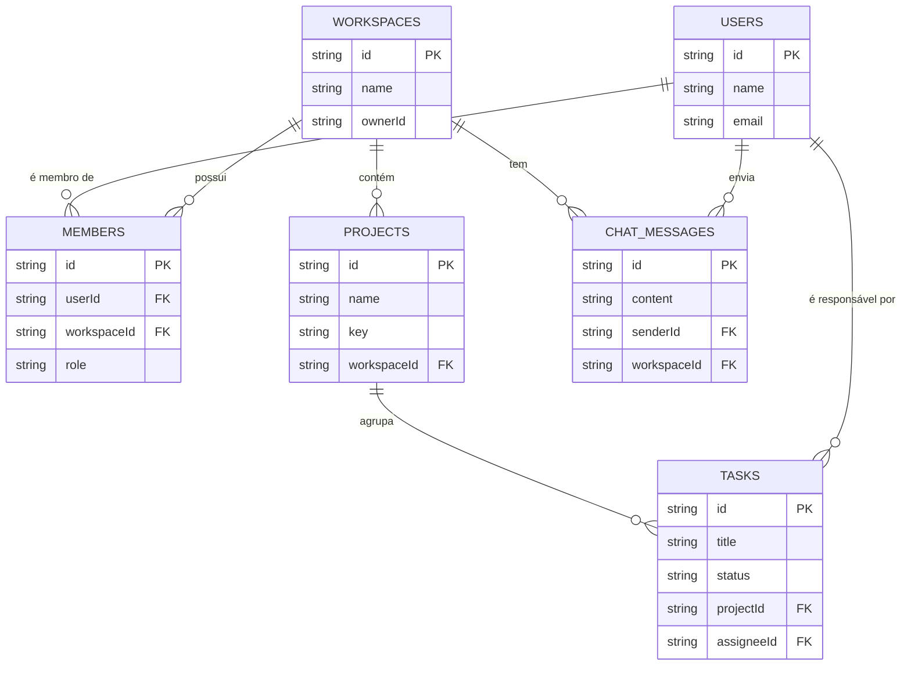

# Esquema do Banco de Dados (Coleções Appwrite)

Este documento descreve a estrutura das coleções de dados no Appwrite que servem como backend para a aplicação.

## Diagrama de Relacionamento

---

## Descrição das Coleções

### 1. `users` (Coleção nativa do Appwrite)

Esta não é uma coleção que criamos, mas sim o serviço de `Auth` do Appwrite. Armazena as informações de todos os usuários registrados.

-   **`$id`** (string): ID único do usuário.
-   **`name`** (string): Nome do usuário.
-   **`email`** (string): Email do usuário, usado para login.
-   **`prefs`** (object): Objeto para armazenar preferências do usuário, como o último workspace acessado.

### 2. `workspaces`

Armazena os workspaces criados pelos usuários. É a entidade central que agrupa projetos, membros e chats.

-   **`$id`** (string): ID único do workspace.
-   **`name`** (string): Nome do workspace (ex: "Projeto Zyneo").
-   **`ownerId`** (string): ID do usuário (`users.$id`) que criou e é o dono do workspace.
-   **Permissões:** O acesso de leitura/escrita é dado a uma `team` do Appwrite que representa os membros do workspace.

### 3. `members`

Funciona como uma tabela pivot para criar a relação **Muitos-para-Muitos** entre `users` e `workspaces`.

-   **`$id`** (string): ID único da associação/membership.
-   **`workspaceId`** (string): ID do workspace (`workspaces.$id`) ao qual o usuário pertence. (Atributo com relacionamento)
-   **`userId`** (string): ID do usuário (`users.$id`) que é membro. (Atributo com relacionamento)
-   **`role`** (string): A função do usuário dentro do workspace (ex: `admin`, `member`).
-   **Permissões:** Apenas o próprio usuário pode ver sua associação, e admins do workspace podem listar todas.

### 4. `projects`

Contém os projetos, que são sempre vinculados a um workspace.

-   **`$id`** (string): ID único do projeto.
-   **`name`** (string): Nome completo do projeto (ex: "Desenvolvimento do App Mobile").
-   **`key`** (string): Um identificador curto e único para o projeto, usado como prefixo para as tarefas (ex: "APP").
-   **`workspaceId`** (string): ID do workspace (`workspaces.$id`) ao qual o projeto pertence. (Atributo com relacionamento)
-   **`icon`** (string, opcional): Um emoji ou URL de ícone para o projeto.
-   **`color`** (string, opcional): Cor hexadecimal para identificar o projeto.
-   **Permissões:** O acesso é herdado da equipe do workspace.

### 5. `tasks` (ou `issues`)

Armazena as tarefas ou issues individuais, cada uma pertencente a um projeto.

-   **`$id`** (string): ID único da tarefa.
-   **`title`** (string): Título da tarefa.
-   **`description`** (string, opcional): Descrição detalhada da tarefa.
-   **`status`** (string): O estado atual da tarefa no fluxo de trabalho (ex: `TODO`, `IN_PROGRESS`, `DONE`).
-   **`priority`** (string, opcional): Prioridade da tarefa (ex: `High`, `Medium`, `Low`).
-   **`projectId`** (string): ID do projeto (`projects.$id`) ao qual a tarefa pertence. (Atributo com relacionamento)
-   **`assigneeId`** (string, opcional): ID do usuário (`users.$id`) responsável pela tarefa. (Atributo com relacionamento)
-   **`reporterId`** (string): ID do usuário que criou a tarefa.
-   **Permissões:** O acesso é herdado da equipe do workspace.

### 6. `chat_messages`

Armazena cada mensagem enviada no chat de um workspace.

-   **`$id`** (string): ID único da mensagem.
-   **`content`** (string): O conteúdo da mensagem (pode ser texto simples ou HTML).
-   **`workspaceId`** (string): ID do workspace (`workspaces.$id`) onde a mensagem foi enviada. (Atributo com relacionamento)
-   **`senderId`** (string): ID do usuário (`users.$id`) que enviou a mensagem. (Atributo com relacionamento)
-   **`$createdAt`** (datetime): Data e hora de criação da mensagem (gerado automaticamente pelo Appwrite).
-   **Permissões:** O acesso é herdado da equipe do workspace, e a funcionalidade de tempo real do Appwrite notifica os membros sobre novas mensagens.
