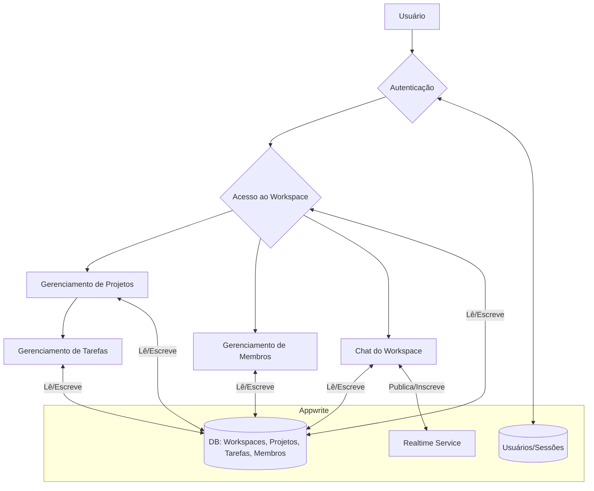

# Arquitetura Geral e Conexão dos Fluxos

Este documento oferece uma visão geral da arquitetura do sistema, explicando como as diferentes partes (autenticação, workspaces, projetos, etc.) se interconectam para formar uma aplicação coesa.

## Visão Geral da Arquitetura

A aplicação segue uma arquitetura moderna baseada em **Next.js (com App Router)** para o frontend e renderização no servidor, e **Hono.js** como um backend leve para servir a API, tudo dentro do mesmo projeto Next.js (monorepo). O **Appwrite** funciona como o Backend-as-a-Service (BaaS), gerenciando o banco de dados, autenticação de usuários, armazenamento de arquivos e eventos em tempo real.

### Componentes Principais:

1.  **Frontend (React/Next.js):**
    *   Localizado em `src/app`.
    *   Usa o **App Router** para roteamento baseado em diretórios.
    *   `layout.tsx`: Define a estrutura da UI (ex: sidebars, navbars).
    *   `page.tsx`: Componentes de página, renderizados no servidor (`RSC`) por padrão.
    *   Componentes de cliente (`"use client"`) para interatividade.
    *   **`react-query`**: Gerencia o estado do servidor no cliente, cacheando dados da API, tratando o recarregamento (refetching) e atualizações otimistas.

2.  **API Backend (Hono.js):**
    *   As rotas da API estão organizadas por feature em `src/features/[feature]/server/route.ts`.
    *   Todas as requisições para `/api/*` são capturadas pelo `src/app/api/[[...route]]/route.ts`, que delega o tratamento para a aplicação Hono.
    *   O Hono oferece um roteador rápido e middleware para validação, autenticação, etc.

3.  **Backend-as-a-Service (Appwrite):**
    *   **Autenticação:** Gerencia usuários, sessões e provedores OAuth.
    *   **Database:** Armazena os dados da aplicação em coleções (ex: `workspaces`, `projects`, `tasks`). O sistema de permissões do Appwrite é crucial para garantir a segurança dos dados.
    *   **Realtime:** Fornece a funcionalidade de tempo real para o chat e outras atualizações ao vivo.

4.  **Comunicação Cliente-Servidor-Appwrite:**
    *   **Requisições do Cliente:** A UI (hooks do `react-query` em `src/features/[feature]/api/`) faz chamadas `fetch` para a API Hono interna (`/api/...`).
    *   **Lógica do Servidor:** A API Hono recebe essas chamadas. Ela contém a lógica de negócios e validação de permissões.
    *   **Interação com Appwrite:** O servidor Hono usa o SDK **`node-appwrite`** (com uma chave de API secreta) para se comunicar com o Appwrite, executando operações privilegiadas (criar documentos, validar permissões).

## Como os Fluxos se Conectam

O `workspace` é a entidade central que conecta quase todos os outros fluxos.

1.  **Ponto de Partida: Autenticação**
    *   Um usuário deve primeiro se autenticar (`/sign-in` ou `/sign-up`). O **Fluxo de Autenticação** cria uma sessão gerenciada por um cookie seguro.
    *   O `session-middleware.ts` protege todas as rotas do dashboard, garantindo que apenas usuários logados possam acessá-las.

2.  **Entrada no Contexto: Workspace**
    *   Após o login, o usuário é direcionado para um workspace (`/workspaces/[workspaceId]`).
    *   O `workspaceId` na URL se torna o **parâmetro de contexto principal** para todas as operações subsequentes.

3.  **Operações Contextualizadas**
    *   **Projetos:** Ao listar ou criar projetos, o `workspaceId` é enviado para a API. O backend filtra a coleção `projects` para retornar apenas aqueles que pertencem a esse workspace.
    *   **Tarefas:** A mesma lógica se aplica. As tarefas são consultadas com base no `projectId`, que por sua vez está ligado a um `workspaceId`.
    *   **Membros:** A lista de membros é específica do `workspaceId`.
    *   **Chat:** Os canais de chat e as mensagens são isolados por `workspaceId`. O sistema de tempo real do Appwrite usa canais específicos para garantir que as mensagens de um workspace não vazem para outro.

4.  **Segurança e Permissões**
    *   A segurança é garantida em duas camadas:
        1.  **Camada da API (Hono):** Antes de executar qualquer operação, o backend **sempre** verifica se o `userId` (da sessão) é um membro registrado do `workspaceId` em questão. Isso impede que um usuário acesse dados de um workspace ao qual não pertence, mesmo que ele adivinhe o ID.
        2.  **Camada do Banco de Dados (Appwrite):** Os documentos no Appwrite são criados com permissões de acesso baseadas em equipes (`team:${teamId}`). Cada workspace tem uma equipe correspondente no Appwrite. Isso fornece uma segunda camada de segurança, garantindo que, mesmo em caso de falha na lógica da API, as regras do banco de dados impeçam o acesso não autorizado.

Essa arquitetura centralizada no conceito de "workspace" garante que os dados sejam devidamente isolados e que a experiência do usuário seja contida e organizada dentro do contexto de sua equipe ou projeto.
